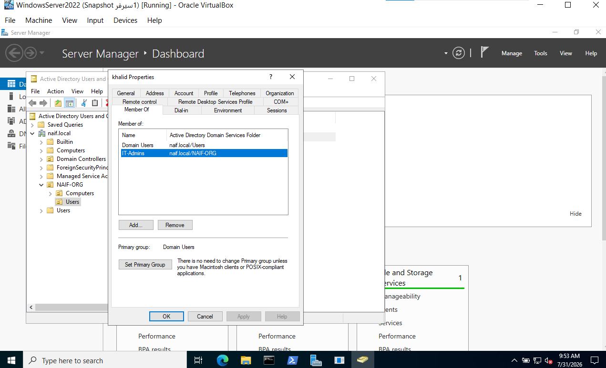
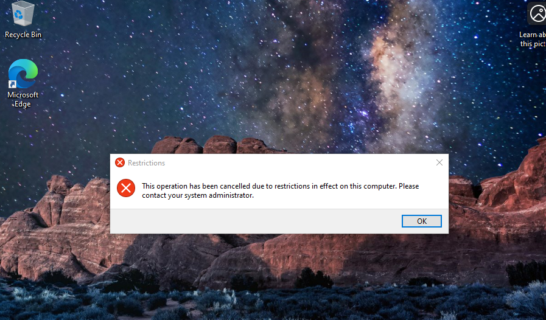

# User and Group Management

## الهدف
إنشاء مستخدم داخل Active Directory وإضافته إلى مجموعة أمنية، ثم التحقق من تسجيل الحدث الأمني.

## الأدوات
- Windows Server 2022
- Active Directory Users and Computers
- Event Viewer

## الخطوات
1. إنشاء المستخدم.
2. إنشاء المجموعة الأمنية.
3. إضافة المستخدم إلى المجموعة.
4. التحقق من Event ID 4728.

## النتيجة
تمت إضافة المستخدم إلى المجموعة بنجاح، وتم تسجيل العملية في سجل الأمان.
## الصور

### عضوية المستخدم في المجموعة

### إنشاء وربط Group Policy

### نتيجة تطبيق السياسة

