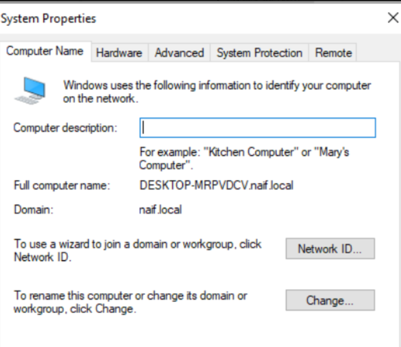
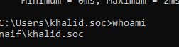

# Join Computer to Domain

## الهدف
ربط جهاز Windows 10 بدومين Active Directory والتحقق من نجاح تسجيل الدخول بحساب دومين.

## البيئة
- Windows Server 2022
- Windows 10
- Domain: `naif.local`
- Domain Controller: `192.168.0.132`

## التنفيذ
1. التحقق من الاتصال بـ Domain Controller.
2. ضبط DNS على عنوان Domain Controller.
3. التحقق من حل `naif.local`.
4. التحقق من انضمام الجهاز إلى الدومين.
5. تسجيل الدخول بحساب `NAIF\khalid.soc`.
6. التحقق باستخدام `whoami`.

## النتائج

### Domain Joined

### Domain Authentication

## النتيجة
تم ربط جهاز Windows 10 بالدومين `naif.local` بنجاح، والتحقق من تسجيل الدخول باستخدام حساب دومين.
