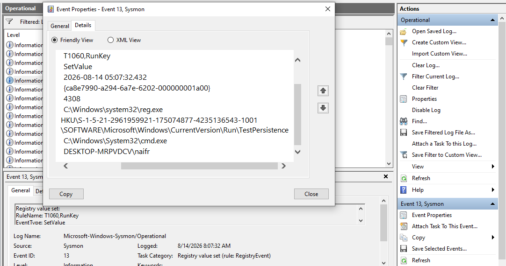

# Registry Persistence Lab

## Overview

A practical threat hunting lab using Sysmon to investigate Windows Registry activity and identify persistence through Registry Run Keys.

## Objectives

* Detect Registry Run Key modifications.
* Analyze Sysmon Registry events.
* Identify automatic execution mechanisms.

## Tools

* Sysmon
* Windows 10
* PowerShell

## Investigation

### 1. Registry Persistence — Run Key Modification

A Registry Run Key value was created to execute `cmd.exe` automatically when the user logs in:

**Run Key → Value Added → Auto-Execution**

### Evidence — Registry Modification (Sysmon Event 13)

