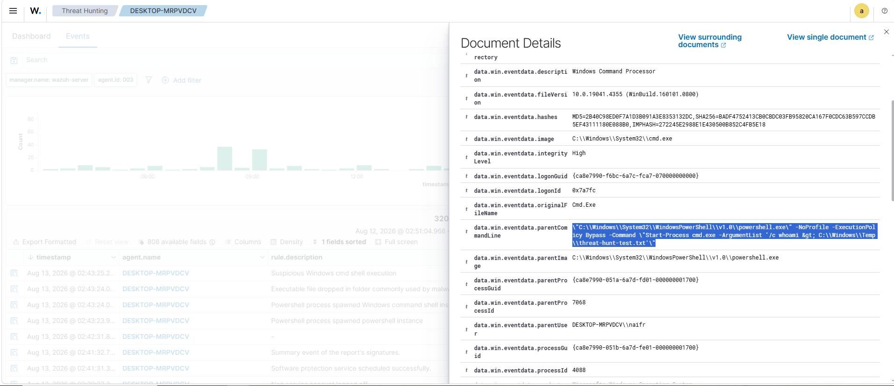

# Threat Hunting Lab

## Overview

A practical threat hunting lab using Wazuh and Sysmon to investigate Windows process and network activity.

## Objectives

- Investigate Windows process creation events.
- Analyze parent-child process relationships.
- Review command-line activity.
- Identify suspicious process execution.
- Review Sysmon network connection telemetry.

## Tools

- Wazuh
- Sysmon
- Windows 10
- PowerShell

## Investigation

### 1. Suspicious Process Chain

A PowerShell process spawned `cmd.exe` to execute `whoami` and redirect the output to a temporary file:

```text
PowerShell → cmd.exe → whoami → File Output
### Evidence — Process Creation (Event 4688)

The event shows PowerShell spawning `cmd.exe` with a command that executes `whoami` and redirects the output to a temporary file.


