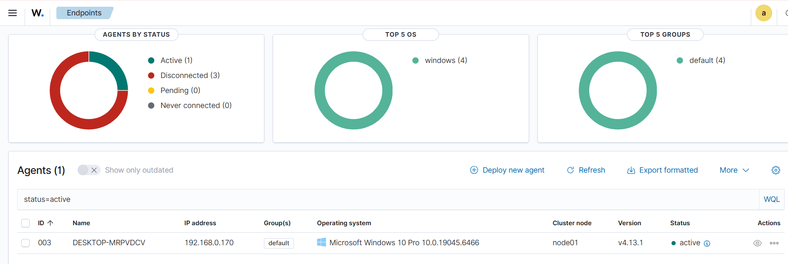
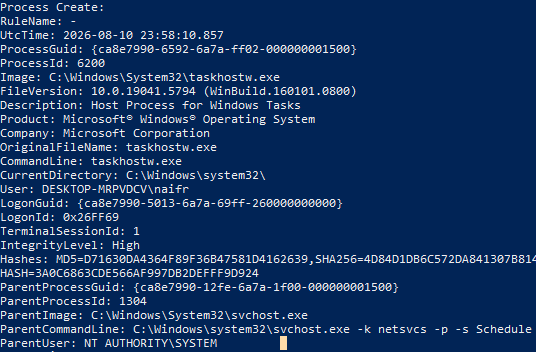
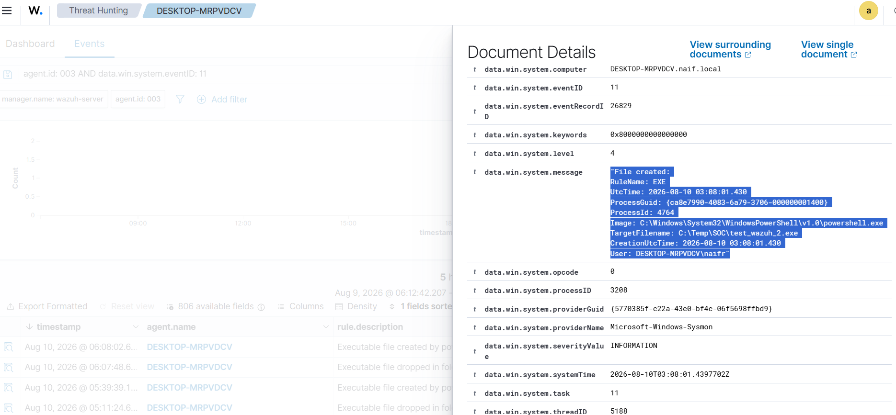
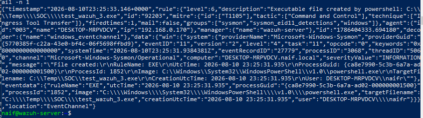

# Wazuh & Sysmon Integration

Integrated a Windows 10 endpoint with Wazuh SIEM and Sysmon for endpoint monitoring.

### Detected Events
- Sysmon Event ID 1 — Process Creation
- Sysmon Event ID 11 — File Creation
- Sysmon Event ID 3 — Network Connection

### Result
Wazuh successfully received and generated an alert for Sysmon Event ID 11.

### Tools
Wazuh | Sysmon | PowerShell
### Evidence

