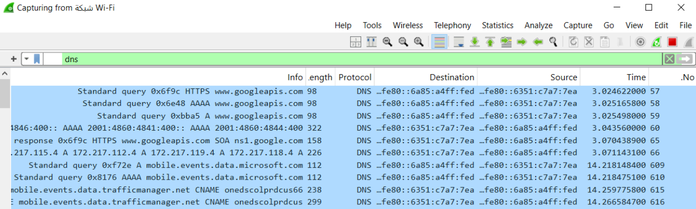
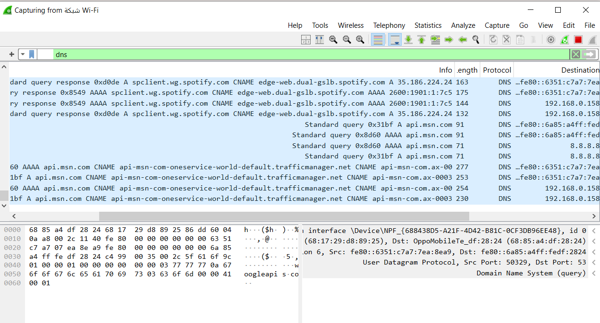

# Wireshark DNS Analysis Lab

Performed DNS traffic analysis using Wireshark to identify normal and suspicious query behavior.

### DNS Results

- Interface: Wi‑Fi
- Filter: dns
- Normal Traffic: googleapis, cloudflare, microsoft
- Suspicious Traffic: unusual domains, repeated queries, NXDOMAIN
- Goal: Differentiate legitimate DNS activity from abnormal patterns

### Tools

Wireshark

### Evidence

**Normal DNS Traffic**  

**Suspicious DNS Traffic**  

